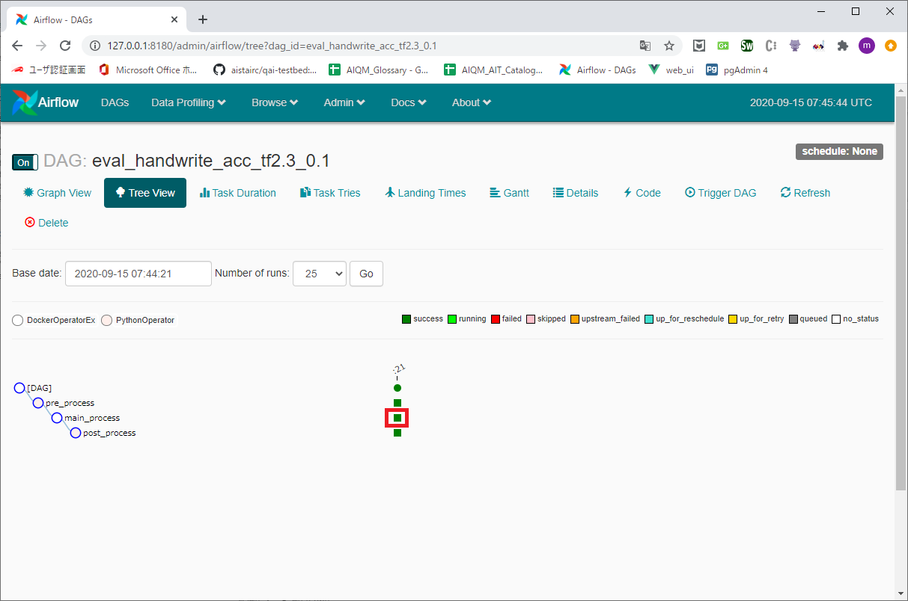
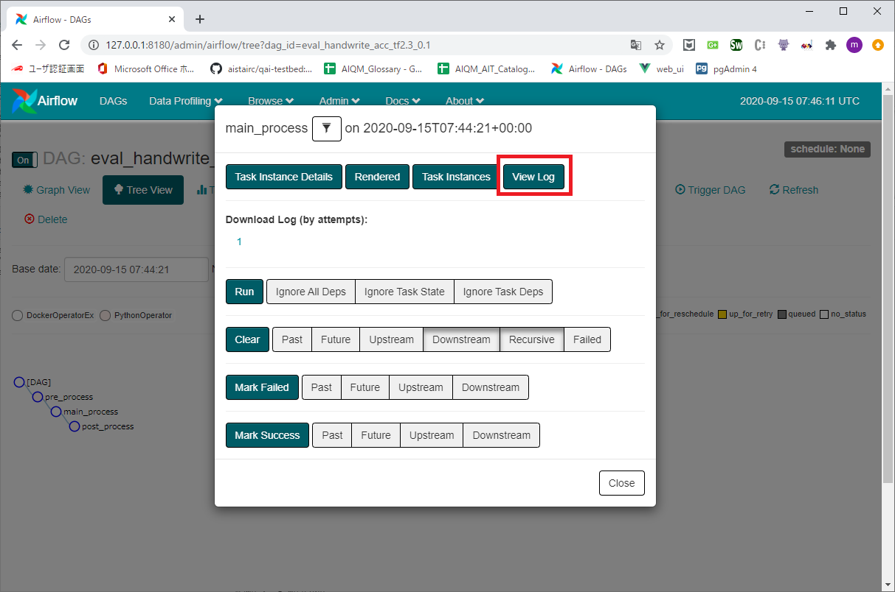

# Test

## prepare

* launch testded

    ```
    cd {testbed_root}
    docker-compose up -d
    ```

## copy template test notebook

* copy src

    ```
    {testbed_root}\ait_repository\test\tests\dev_template_local_docker_0.1.ipynb
    ```

* copy dst

    ```
    {testbed_root}\ait_repository\test\tests\{Your AIT name}.ipynb
    ```

## launch testing jupyter lab

* execute

    ```
    {testbed_root}\ait_repository\test\tools\launch_jupyter.bat
    ```

## edit config.json

* file path

    ```
    {testbed_root}\ait_repository\test\tests\config.json
    ```

* contents

    ```
    {
        "host_ait_root_dir" : "C:\\github\\qai-testbed\\ait_repository",
        "is_container": true
    }
    ```

    * `host_ait_root_dir` is your checkout path.
    * `is_container` is testbed launch mode and always `true`. `false` is used by testbed developer.

## edit {Your AIT name}.ipynb in jupyter lab

### [cell:1] pip install ait-sdk

* if `ait_sdk-X.X.X-py3-none-any.whl` is changed, update this.

### [cell:3] setting

* `ait_name` and `ait_version` is change your's.

### [cell:9] post inventories

* You need to make an API call to the inventory you have defined in ait.manifest.json.

### [cell:10] get inventories

* get inventories by name.

### [cell:11] add test description

* Add a TestDescription corresponding to the ait.manifest.json definition.

### [cell:13] run test description

* if `Result` is `ERR` is wrong.  
  please check [Airflow](http://127.0.0.1:8180/admin/) log.

    

    

    

    

### [cell:15] output report

* response `ReportUrl` use report download.

    ```
    <Response [200]>
    {'OutParams': {'ReportUrl': 'http://127.0.0.1:8888/qai-testbed/api/0.0.1/download/20'},
    'Result': {'Code': 'D12000', 'Message': 'command invoke success.'}}
    <bound method Response.json of <Response [200]>>
    ```
