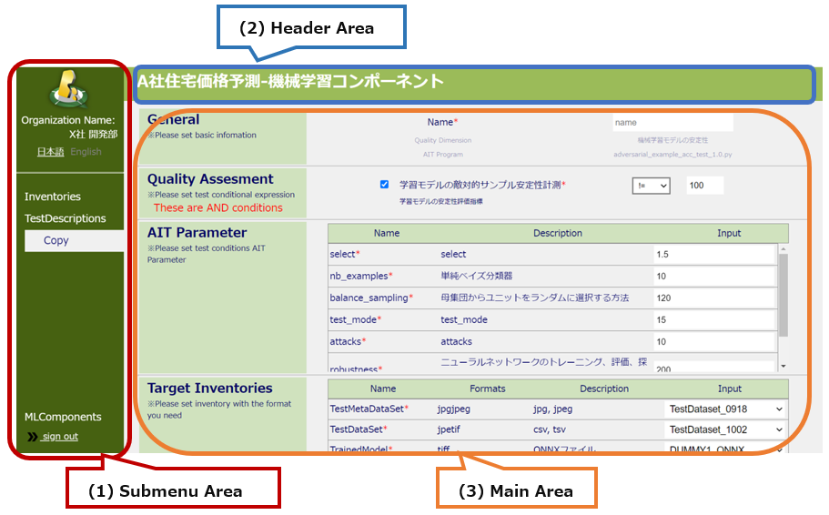
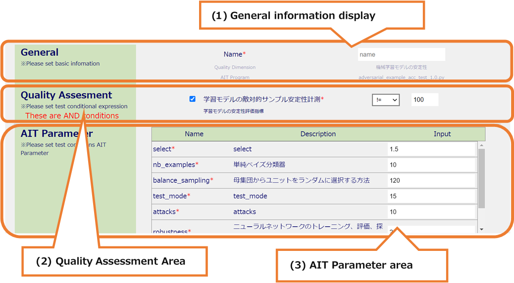
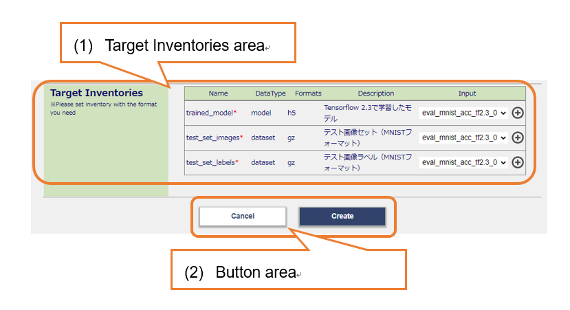

# TestDescriptionsCopy

Copy the created TestDescription and create a TestDescription with a parent-child relationship

## All areas

* All areas

  

  * (1) Submenu area
    * a. Sign-in Information Display
    * b. Language Switching (Japanese / English)
    * c. Inventories
    * d. TestDescriptions
    * e. Display Contents
    * f. MLComponents
    * g. Sign-out

  * (2) Header area
    * a. MLComponent name display

  * (3) Main area
    * a. General information input
    * b. Quality Assessment area
    * c. AIT Parameter area
    * d. Target Inventories area
    * e. Button area

## Main Area

* Main Area (first half)

  

  * (1) General information display
    * It is possible to register a new name.
    * Quality Dimension and AIT Program cannot be changed.

  * (2) Quality Assessment Area
    * It is possible to set the Quality Assessment information you want to register.
    * The registered information of the copy source has been entered.
    * If you check the check box, you can enter it.
    * If there are multiple items, the test pass condition is in the relationship of "&".
    * After confirming the item name and detailed information, you can set the test pass condition by selecting the relational operator in the select box and entering the value.
    * If the check box is unchecked, it becomes inactive and can be registered as not subject to the test pass conditions.

  * (3) AIT Parameter area
    * It is possible to set the information of the AIT Parameter you want to register.
    * The registered information of the copy source has been entered.
    * Check the name and detailed information, and enter the input value.
    * If there are many display items, it can be scrolled.

* Main Area (second  half)

  

  * (1) Target Inventories area
    * Select the Target Inventory you want to register.
    * The registered information of the copy source has been entered.
    * Check the name, format, detailed information, and select Inventory.
    * If there are many display items, it is possible to scroll.
    * If there is no Inventory that matches the format, it is possible to add an Inventory by pressing the Add Inventory button to display the Add Inventory modal.

  * (2) Button area
    * It is possible to create Description by pressing the Create button.
    * If there is an input error, an error message will be displayed at the top of the screen.
    * It is possible to return to the Test Descriptions screen by pressing the Cancel button.
